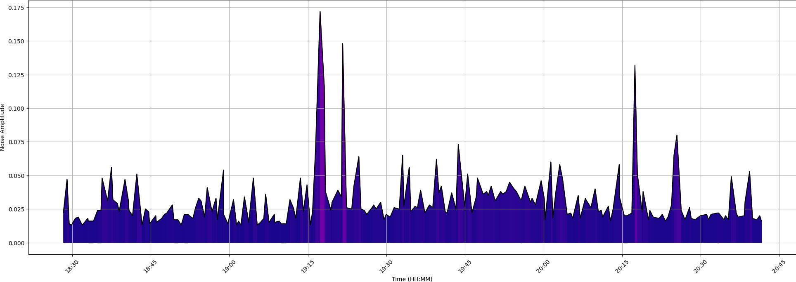
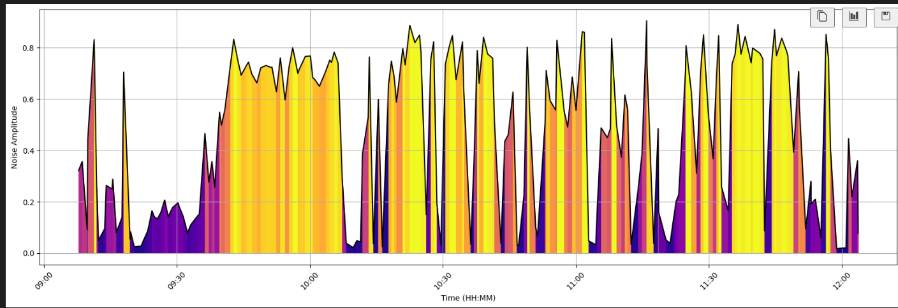

# Stop it!

Are you afraid to leave your recently adopted puppy alone in your apartment because of the barking? Then this suits your needs! 

<p align="center">
    
</p>

## 💡 The idea

Tobia is a 3-month-old cocker spaniel English puppy. He's so affectionate to his owner that when he's left alone in the flat, he makes so much noise that it disturbs the neighbours.

Look at these plots. When the owner is at home, the average noise level in the apartment is as follows:
<p align="center">
    
</p>

But as soon as the owner leaves, Tobia goes mad and starts crying and barking. The noise becomes:
<p align="center">
    
</p>

Fortunately, Tobia obeys his owner's commands and tends to be quiet when scolded.

This is the idea behind this project. Connect a good enough speaker to your PC and let the software automatically scold it for you! **All you have to do is prepare a bunch of short scolding recordings.**

# 🔧 How it works

1. Record your voice while scolding the puppy several times.
2. Put these recordings in the folder `alerts\`.
3. Tune the constant parameters in the `stop_it.py` script (optional).
4. Execute the script with the command `python stop_it.py`

You can watch the real-time noise plot by launching the webserver `web_server.py` and navigating to 
>**https://localhost:8080/noise/plot?max_hours=12&max_points=200**

Make sure to generate the public/private SSL keys with the following commands:
```[bash]
openssl genrsa -out key.pem 2048
openssl req -new -x509 -key key.pem -out cert.pem -days 365
```
and put them inside the `secrets/` folder.


